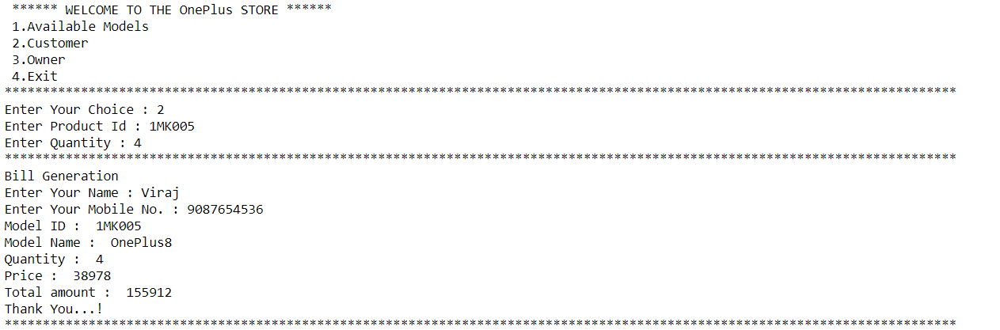
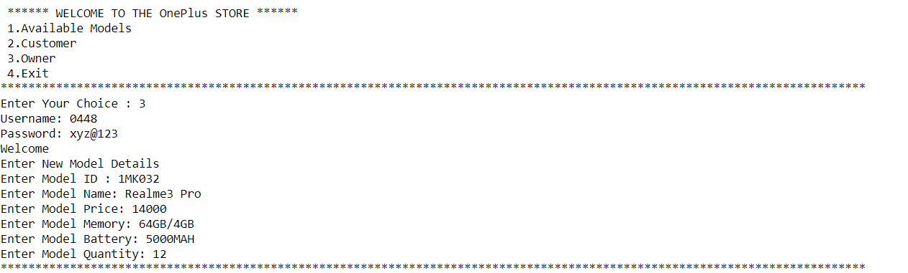
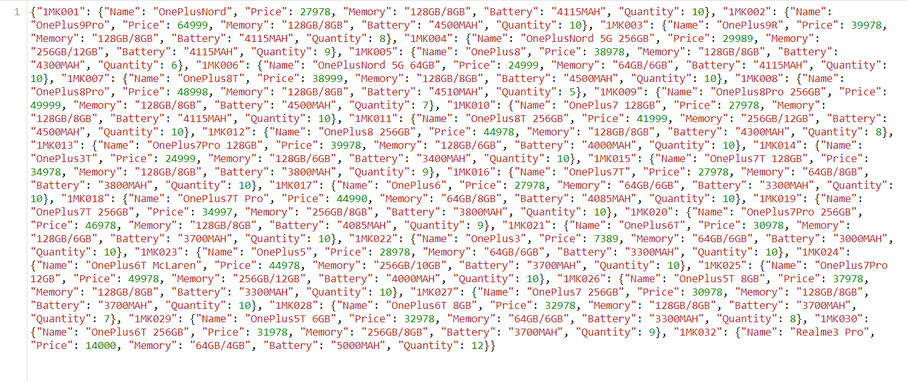

# ETG-Inventory-Management-System
This repository is having all the codes with json files for making an Inventory management System during ETG AT/ML Internship. It is based on NoSQL based databse, I've used JSON file system for it. Following functionalities can be provided,

1. Purchase of items can be done
2. New items in inventory can be added 
3. Bill generation
4. History of sold items with customer details

## Output
1. Purchasing of items with bill 

2. Add new items in inventory

3. Updated Json file after adding items

